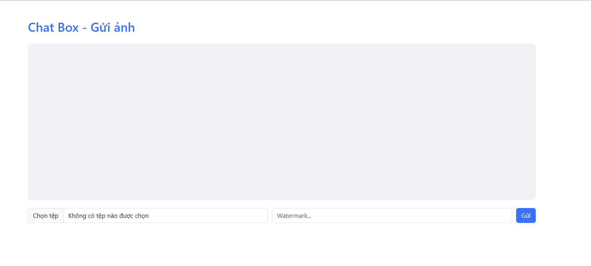
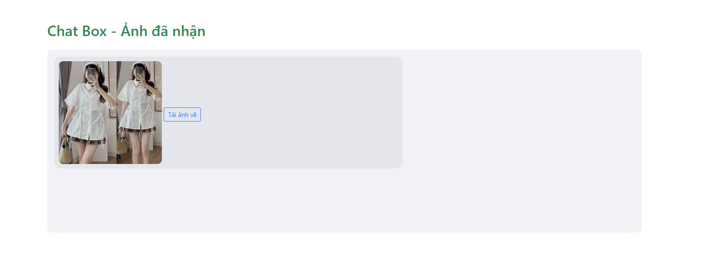

# 📷 Secure Image Transfer with Watermark

## 🚀 Giới thiệu

**Secure Image Transfer with Watermark** là một hệ thống truyền nhận ảnh an toàn, bảo vệ bản quyền và đảm bảo tính toàn vẹn, xác thực của dữ liệu hình ảnh khi truyền qua mạng. Hệ thống sử dụng các kỹ thuật mã hóa, ký số, kiểm tra toàn vẹn hiện đại, đồng thời cung cấp **giao diện web hiện đại, thân thiện, chuyên nghiệp** cho cả người gửi và người nhận.

---

## 🖼️ Mô tả giao diện chương trình

### **Giao diện gửi ảnh (Sender)**
- **Thiết kế hiện đại, chuyên nghiệp:** Sử dụng màu sắc gradient, icon, bố cục rõ ràng, thân thiện với người dùng.
- **Thanh điều hướng:** Có logo, các liên kết nhanh như Trang chủ, Gán Watermark, Lịch sử watermark.
- **Khu vực tải ảnh:**  
  - Nút tải ảnh lên với icon nổi bật.
  - Hỗ trợ kéo-thả ảnh hoặc chọn từ thiết bị.
  - Có thể nhập watermark trực tiếp.
  - Nút gửi ảnh rõ ràng, dễ thao tác.
- **Ảnh mẫu:** Hiển thị các ảnh mẫu để người dùng thử nghiệm nhanh.
- **Hướng dẫn sử dụng:**  
  - Các bước chèn watermark minh họa bằng hình ảnh và mô tả chi tiết.
- **Thông tin tính năng:**  
  - Các box mô tả tính năng nổi bật như: tùy chỉnh watermark, xử lý hàng loạt, bảo mật, giao diện thân thiện.
- **Footer:**  
  - Thông tin thương hiệu, liên kết hỗ trợ, mạng xã hội, bản quyền.

### **Giao diện nhận ảnh (Receiver)**
- **Hiển thị ảnh nhận được:** Ảnh sẽ được hiển thị trực tiếp trên giao diện sau khi nhận thành công.
- **Nút tải ảnh về:** Cho phép người dùng tải ảnh đã nhận về máy.
- **Thông báo trạng thái:** Hiển thị thông báo khi nhận thành công hoặc có lỗi.
- **Thiết kế đồng bộ với giao diện gửi:** Sử dụng Bootstrap, màu sắc hài hòa, dễ sử dụng.

---

## 🗂️ Cấu trúc dự án

```
BMTT/
│
├── sender.py          # Flask app cho giao diện gửi ảnh (web)
├── receiver.py        # Flask app cho giao diện nhận ảnh (web)
├── utils.py               # Hàm tiện ích: watermark, mã hóa, ký số, hash
├── templates/
│   ├── sender.html        # Giao diện web gửi ảnh (hiện đại, chuyên nghiệp)
│   └── receiver.html      # Giao diện web nhận ảnh (hiện đại, chuyên nghiệp)
├── static/                # Chứa ảnh, css, js, icon, v.v.
├── sender_private.pem     # Khóa riêng của sender (tự sinh lần đầu)
├── sender_public.pem      # Khóa công khai của sender
├── receiver_private.pem   # Khóa riêng của receiver (tự sinh lần đầu)
├── receiver_public.pem    # Khóa công khai của receiver
├── README.md
└── ...
```

---

## 🛠️ Cài đặt môi trường

**Yêu cầu:**  
- Python 3.7 trở lên

**Cài đặt các thư viện cần thiết:**
```bash
pip install pillow pycryptodome flask requests
```

---
## 🌐 Hướng dẫn sử dụng trên Localhost & Mạng LAN

### 1. **Chạy trên cùng một máy (localhost)**

- **Bước 1:** Mở 2 terminal.
- **Bước 2:** Terminal 1 chạy receiver:
    ```bash
    python receiver.py
    ```
    → Truy cập giao diện nhận tại: [http://localhost:5001](http://localhost:5001)

- **Bước 3:** Terminal 2 chạy sender:
    ```bash
    python sender.py
    ```
    → Truy cập giao diện gửi tại: [http://localhost:5000](http://localhost:5000)

- **Lưu ý:**  
  - Trong file `sender.py`, đặt:
    ```python
    RECEIVER_URL = 'http://localhost:5001/receive'
    ```
  - Không cần dùng LocalTunnel.

---

### 2. **Chạy trên 2 máy cùng mạng LAN**

- **Bước 1:** Xác định địa chỉ IP của máy **Receiver** (ví dụ: `192.168.1.10`).
    - Có thể kiểm tra bằng lệnh:
      - Windows: `ipconfig`
      - Mac/Linux: `ifconfig` hoặc `ip a`

- **Bước 2:** Trên máy **Receiver**, chạy:
    ```bash
    python receiver.py
    ```
    - Nếu muốn cho phép các máy khác truy cập, sửa trong `receiver.py`:
      ```python
      app.run(host='0.0.0.0', port=5001)
      ```
    - Truy cập giao diện nhận tại: `http://192.168.1.10:5001`

- **Bước 3:** Trên máy **Sender**, mở file `sender.py`, sửa:
    ```python
    RECEIVER_URL = 'http://192.168.1.10:5001/receive'
    ```
    - Chạy:
      ```bash
      python sender.py
      ```
    - Truy cập giao diện gửi tại: `http://localhost:5000`

- **Lưu ý:**  
  - Đảm bảo cả hai máy cùng kết nối một mạng LAN.
  - Nếu gặp lỗi kết nối, kiểm tra firewall trên máy receiver.

---

## ⚡ Hướng dẫn sử dụng (Sử dụng Tunnel qua Internet)

### 1. **Khởi tạo khóa RSA**
- Khi chạy lần đầu, chương trình sẽ tự động sinh cặp khóa RSA cho cả sender và receiver.
- Nếu chạy trên hai máy, hãy copy file public key giữa hai bên để xác thực.

---

### 2. **Cấu hình & Khởi động hệ thống**

#### 📥 Trên máy **Receiver** (nhận ảnh)
- **Bước 1:** Chạy Flask:
    ```bash
    python receiver.py
    ```
    → Flask sẽ chạy trên `http://localhost:5001`

- **Bước 2:** Khởi động LocalTunnel:
    ```bash
    lt --port 5001
    ```
    → Sau đó bạn sẽ nhận được đường dẫn như:
    ```
    your url is: https://blue-tiger-76.loca.lt
    ```

- Đây là đường dẫn công khai mà các máy khác (sender) có thể gửi ảnh tới.

---

#### 📤 Trên máy **Sender** (gửi ảnh)

- Mở file `sender.py`, sửa biến `RECEIVER_URL`:
    ```python
    RECEIVER_URL = 'https://blue-tiger-76.loca.lt/receive'
    ```

- Chạy ứng dụng sender:
    ```bash
    python sender.py
    ```

- Mở trình duyệt truy cập:
    ```
    http://localhost:5000
    ```

- Giao diện gửi ảnh sẽ xuất hiện:
    - Chọn ảnh
    - Nhập watermark
    - Nhấn **Gửi**

---

### ✅ Ghi chú quan trọng:

- **KHÔNG ĐÓNG terminal** đang chạy lệnh `lt --port 5001`, vì nếu tắt, tunnel sẽ mất kết nối và sender không gửi được ảnh.
- Mỗi lần bạn chạy lại LocalTunnel, URL sẽ thay đổi → bạn cần cập nhật lại `RECEIVER_URL` trong `sender.py`.

---

### 📡 Sơ đồ kết nối

```
Sender (http://localhost:5000)
       |
       v
LocalTunnel URL (https://abc.loca.lt/receive)
       |
       v
Receiver (http://localhost:5001)
```

---

## 💡 Tính năng nổi bật

- **Watermark chéo:** Bảo vệ bản quyền, chống sao chép ảnh.
- **Mã hóa & xác thực:** Đảm bảo an toàn, toàn vẹn, chống giả mạo.
- **Giao diện web hiện đại:** Sử dụng Bootstrap, gradient, icon, preview ảnh gửi và hiển thị ảnh nhận trực tiếp.
- **Trò chuyện realtime:** Chat hai chiều, gửi ảnh có watermark ngay trong khung chat.
- **Dễ sử dụng:** Chỉ cần trình duyệt, không cần cài đặt thêm phần mềm ngoài Python.
- **Có thể mở rộng:** Hỗ trợ nhiều ảnh, lịch sử gửi/nhận, xác thực nâng cao...

---

## 📸 Demo giao diện

| Giao diện gửi ảnh (Sender) | Giao diện nhận ảnh (Receiver) |
|---------------------------|-------------------------------|
|  |  |

> *Bạn có thể thay thế `photo.jpg` bằng bất kỳ ảnh nào bạn muốn gửi.*

---

## 📝 Ghi chú

- Nếu chạy trên 2 máy, hãy copy file public key giữa hai bên.
- Nếu gặp lỗi font khi watermark, hãy cài đặt font `arial.ttf` hoặc chỉnh lại tên font trong `utils.py`.
- Có thể mở rộng thêm các tính năng như: gửi nhiều ảnh, chat, xác thực 2 lớp, lưu lịch sử, v.v.

---

## ❓ Câu hỏi thường gặp

**Q:** Không gửi được ảnh, báo lỗi kết nối?  
**A:** Kiểm tra lại địa chỉ tunnel (loca.lt), port, firewall và đảm bảo receiver đang chạy trước sender.

**Q:** Ảnh nhận được không có watermark?  
**A:** Kiểm tra lại hàm `add_watermark` trong `utils.py` và font chữ.

**Q:** Muốn mở rộng giao diện hoặc thêm tính năng?  
**A:** Bạn có thể chỉnh sửa file HTML trong thư mục `templates/` hoặc liên hệ nhóm phát triển để được hỗ trợ.

---

## 📧 Liên hệ & đóng góp

Mọi ý kiến đóng góp, vui lòng tạo issue hoặc pull request tại:  
[https://github.com/duytienkaka/ATBMTT](https://github.com/duytienkaka/ATBMTT)

---

**© 2025 - Nhóm Sentinel 3**

**👨‍💻 Thành viên nhóm:**
> **Phạm Đức Duy Tiến**  
> **Nguyễn Quang Thịnh**  
> **Dương Văn Việt**

---
