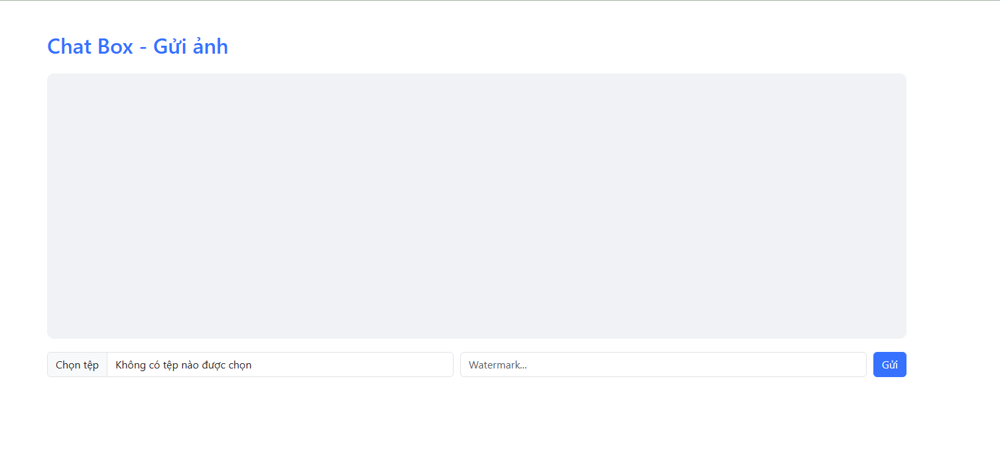
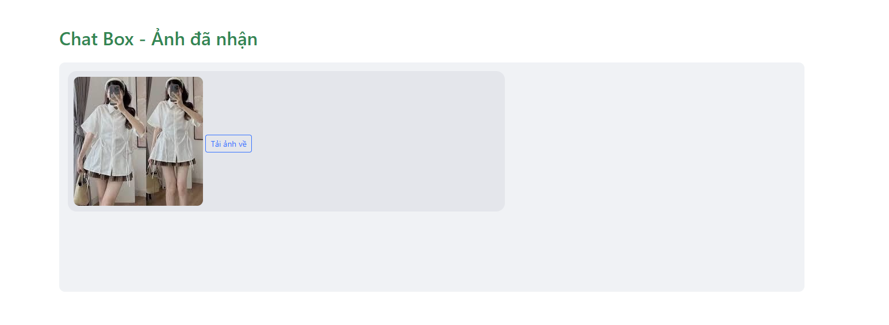

# 📷 Secure Image Transfer with Watermark

## 🚀 Giới thiệu
Đây là hệ thống **truyền ảnh an toàn** với watermark, sử dụng các kỹ thuật mã hóa và xác thực hiện đại:
- **Mã hóa ảnh:** DES (Data Encryption Standard)
- **Trao đổi khóa & ký số:** RSA 2048-bit (PKCS#1 v1.5 + SHA-512)
- **Kiểm tra toàn vẹn:** SHA-512
- **Bảo vệ bản quyền:** Thêm watermark chéo lên ảnh

## 🗂️ Cấu trúc dự án
```
BMTT/
│
├── sender.py              # Gửi ảnh có watermark, mã hóa, ký số
├── receiver.py            # Nhận, xác thực, giải mã, lưu ảnh
├── utils.py               # Hàm tiện ích: watermark, mã hóa, ký số, hash
├── sender_gui.py          # Giao diện gửi ảnh (Tkinter)
├── receiver_gui.py        # Giao diện nhận ảnh (Tkinter)
├── photo.jpg              # Ảnh mẫu (có thể thay bằng ảnh thật)
├── README.md
└── ...
```

## 🛠️ Cài đặt môi trường
Yêu cầu Python 3.7+
```bash
pip install pillow pycryptodome
```

## ⚡ Hướng dẫn sử dụng

### 1. **Khởi tạo khóa RSA**
Chạy lần đầu, chương trình sẽ tự động sinh cặp khóa RSA cho sender và receiver.

### 2. **Chạy chương trình**
- **Bước 1:** Mở terminal, chạy receiver (hoặc giao diện nhận):
    ```bash
    python receiver_gui.py
    ```
    hoặc
    ```bash
    python receiver.py
    ```
- **Bước 2:** Mở terminal khác, chạy sender (hoặc giao diện gửi):
    ```bash
    python sender_gui.py
    ```
    hoặc
    ```bash
    python sender.py
    ```

### 3. **Gửi và nhận ảnh**
- Chọn ảnh, nhập watermark, nhấn gửi.
- Ảnh nhận được sẽ lưu thành `received_photo.jpg` và hiển thị trực tiếp trên giao diện receiver.

## 💡 Tính năng nổi bật
- **Watermark chéo:** Bảo vệ bản quyền, chống sao chép ảnh.
- **Mã hóa & xác thực:** Đảm bảo an toàn, toàn vẹn, chống giả mạo.
- **Giao diện chat:** Trực quan, dễ sử dụng, hiển thị lịch sử gửi/nhận và ảnh ngay trên khung chat.
- **Nhận nhiều ảnh liên tục:** Receiver luôn sẵn sàng, không cần khởi động lại.

## 📸 Demo giao diện

| Sender (Gửi ảnh) | Receiver (Nhận ảnh) |
|------------------|--------------------|
|  |  |

> *Bạn có thể thay thế `photo.jpg` bằng bất kỳ ảnh nào bạn muốn gửi.*

## 📝 Ghi chú
- Nếu chạy trên 2 máy, hãy copy file public key giữa hai bên.
- Nếu gặp lỗi font khi watermark, hãy cài đặt font `arial.ttf` hoặc chỉnh lại tên font trong `utils.py`.

## 📧 Liên hệ & đóng góp
Mọi ý kiến đóng góp, vui lòng tạo issue hoặc pull request tại:  
[https://github.com/duytienkaka/ATBMTT](https://github.com/duytienkaka/ATBMTT)

---
**© 2025 Duy Tiến - duytienkaka@gmail.com**
